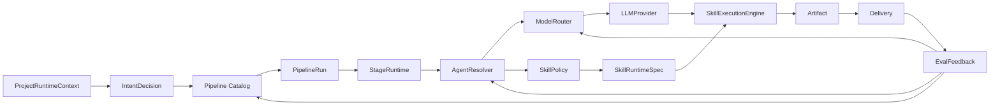

# AI Runtime 收敛架构

本文档定义 AgentForge 长期 AI 架构的主线、当前实现基线、目标运行时契约和迁移任务边界。它是 TASK-027 的产物，也是 TASK-028 到 TASK-034 的共同参考。

## 1. 定位

AgentForge 的长期形态不是“多 Agent 聊天页”，而是面向全栈开发工程师的项目级 AI 开发操作系统：

```text
Project -> Intent -> Pipeline -> Stage -> Agent/Profile -> Skill Runtime -> Artifact -> Delivery -> Eval Feedback
```

这条链路的核心价值是：用稳定的软件工程对象包住不稳定的 AI 行为，让每次执行都能被规划、观察、确认、交付和复盘。

## 2. 当前真实链路

截至 TASK-028，代码里的主链路已经具备 Project-first 基础，并已把 Pipeline 阶段定义收敛到后端 Catalog；Agent、Model、Skill、Governance 和 Eval 仍需要继续进入统一 AI Runtime Contract。

### 2.1 请求到执行

```text
src/api/routes/sessions.py
  -> _run_task_with_skills()
  -> LLMConfig(settings.default_model, temperature, max_tokens)
  -> SkillRegistry.get_all_tool_defs()
  -> StageRuntime.run_current_stage()
```

现状：

- Chat 入口会创建 Task、Message，并在后台任务中执行。
- 用户自定义助手名来自 `UserAgentSettings.agent_name`，传给 SkillExecutionEngine 的 system prompt。
- 模型选择来自全局 settings 的 `default_model`。
- 工具列表来自全局 SkillRegistry 的全部 tool defs。

缺口：

- 还没有按 Project / Stage / AgentProfile 解析模型路由。
- 还没有按 AgentProfile 或 StageDefinition 过滤 Skill。
- Agent 管理页创建的 active `Agent` 已可通过 AgentResolver 进入 StageRuntime 选择链路。

### 2.2 Pipeline 状态机

```text
src/agent_forge/pipeline/catalog.py
  -> PIPELINE_CATALOG
src/agent_forge/pipeline/service.py
  -> create_pipeline_run_for_session()
  -> PipelineRun + PipelineStageState
src/agent_forge/pipeline/runtime.py
  -> start_stage()
  -> SkillExecutionEngine.run()
  -> complete_stage()
```

现状：

- `PIPELINE_CATALOG` 是 intent -> StageDefinition 的后端唯一事实源。
- `PipelineRun` 记录 intent、状态、current_stage_id。
- `PipelineStageState` 记录阶段状态、是否 required、是否 confirmation_required。
- `StageRuntime` 从 Catalog 读取 StageDefinition，负责 stage started / completed / failed 与 SSE。
- confirmation_required 阶段完成后进入 `waiting_confirmation`。
- 前端通过 `/api/v1/pipeline/catalog` 读取阶段定义、默认动作和 placeholder。

缺口：

- StageDefinition 已包含输出物类型、默认 Agent selector、模型路由 key 和 Skill policy key；`default_agent_selector` 已绑定 AgentResolver，ModelRouter 和 SkillPolicy 仍待后续任务接入。
- 风险策略仍停留在 confirmation 字段和 confirmation_gate，尚未进入统一 GovernancePolicy。
- 前端仍保留 intent 展示 label/icon，但阶段业务语义已以后端 Catalog 为准。

### 2.3 Skill Runtime

```text
src/agent_forge/skills/registry.py
  -> SkillRegistry.register()
  -> get_all_tool_defs()
src/agent_forge/skills/engine.py
  -> llm.tool_use_complete(messages, tools, config)
  -> SkillDispatcher.invoke()
src/agent_forge/skills/dispatcher.py
  -> registry.get_executor(tool_name)
```

现状：

- 内置 Skill 和 MCP tool 可以注册到 SkillRegistry。
- SkillExecutionEngine 实现 ReAct tool_use 循环。
- SkillDispatcher 支持超时、SSE 事件、tracing。
- DB 中的 enabled Skill 可被 `get_enabled_tool_defs()` 过滤，但主执行路径当前使用 `get_all_tool_defs()`。

缺口：

- SkillRegistry 只保存 tool_defs 和 executor，没有统一 SkillRuntimeSpec。
- 外部 Skill 导入缺少完整 Manifest / 权限 / 风险 / 审计闭环。
- Skill 调用前还没有统一 SkillPolicy。

### 2.4 LLM Provider

```text
src/agent_forge/llm/provider.py
  -> LLMConfig(model, temperature, max_tokens, timeout)
  -> LiteLLMProvider
  -> FallbackLLMProvider
```

现状：

- LLMProvider 支持 complete、chat_complete、stream_complete、tool_use_complete。
- stream_complete 支持 thinking 事件拆分。
- LiteLLMProvider 使用 settings 中的 base_url、api_key 和 default_model。
- FallbackLLMProvider 能在 litellm 不可用时降级。

缺口：

- Provider、Model、Credential、Route 没有拆成可管理对象。
- API Key 还没有和模型路由、项目、AgentProfile 建立可治理关系。
- StageRuntime 不能按阶段或 Agent 选择模型。

### 2.5 Artifact 和 Delivery

```text
StageRuntime._complete_stage()
  -> create_stage_artifact()
  -> emit_artifact_created()
Artifact Viewer
  -> DeliveryService preview/apply
```

现状：

- 阶段输出会归档为 Artifact。
- Artifact 可被 Chat、Project、Viewer 使用。
- Delivery 已支持本地写回、GitHub PR、zip 包。
- Delivery preview/apply 有一致性校验和失败报告。

缺口：

- Artifact 尚未记录生成它的 AgentProfile、ModelRoute、SkillRuntime。
- Delivery 结果尚未进入统一 Eval Feedback。

## 3. 目标运行时契约

AI Runtime Contract 是跨 Pipeline、Agent、LLM、Skill、Artifact、Delivery 和 Eval 的稳定上下文。后续任务应优先复用这些对象名，避免每个模块再发明一套概念。

### 3.1 ProjectRuntimeContext

作用：描述一次执行所属的项目、会话、授权代码库和安全边界。

字段方向：

```text
project_id
session_id
pipeline_run_id
user_id
mounts
active_mount_id
workspace_policy
delivery_policy
audit_context
```

当前映射：

- `Project`、`ProjectMount`、`Session` 已存在。
- Bridge 和 Delivery 已受 Mount 边界约束。
- audit_context 分散在 AuditLog 调用中。

后续收敛：

- 后续 StageRuntime 应显式接收或构建 ProjectRuntimeContext，避免 Project / Mount / Delivery / Audit 边界继续分散。
- Delivery 和 SkillPolicy 复用同一授权边界。

### 3.2 IntentDecision

作用：表示用户需求分类结果，并决定 Pipeline。

字段方向：

```text
intent_type
confidence
reason
risk_level
required_capabilities
pipeline_key
```

当前映射：

- `Session.intent_type` 和 `PipelineRun.intent_type` 已存在。
- `normalize_intent()` 当前把未知类型回退为 `iteration`。

后续收敛：

- Pipeline Catalog 已把 intent 到阶段的映射服务化；后续可把 confidence、reason 和 risk_level 写入 PipelineRun metadata 或独立 IntentDecision 表。
- 未来可把 confidence、reason 和 risk_level 写入 PipelineRun metadata 或独立 IntentDecision 表。

### 3.3 StageDefinition

作用：定义阶段业务语义、运行策略和前端渲染事实源。

字段方向：

```text
key
name
description
order
required
required_inputs
output_artifact_types
confirmation_policy
default_agent_selector
model_route_key
skill_policy_key
can_skip
can_restore
```

当前映射：

- `StageDefinition(stage_id, stage_name, description, required, confirmation_required, output_artifact_types, default_agent_selector, model_route_key, skill_policy_key)` 已存在。
- `PipelineStageState` 保存阶段运行状态。
- `Pipeline Catalog API` 已向前端提供 intent 对应阶段、确认策略和默认快捷动作。

后续收敛：

- `default_agent_selector` 已绑定到真实 AgentProfile。
- TASK-030 将 `model_route_key` 绑定到真实 ModelRoute。
- TASK-031 将 `skill_policy_key` 绑定到真实 SkillPolicy。

### 3.4 AgentProfile

作用：把后台 Agent 配置接入运行时选择。

字段方向：

```text
id
name
capabilities
default_model_route_key
allowed_skill_names
system_policy_key
stage_preferences
enabled
```

当前映射：

- `Agent` 模型已有 name、capabilities、model、status、avatar_url。
- `AgentResolver` 已把 active Agent 解析成运行时 AgentProfile。
- `PipelineStageState` 已记录 agent_profile_id、agent_profile_name、agent_profile_source。
- `UserAgentSettings` 当前只影响 assistant 名称和头像。
- StageRuntime 接收 fallback `agent_name`，但会优先使用 AgentResolver 返回的 AgentProfile name 和上下文。

后续收敛：

- TASK-030 将 AgentProfile 的 model_name / default_model_route_key 交给 ModelRouter。
- TASK-031 将 AgentProfile 的 allowed_skill_names 交给 SkillPolicy。
- `UserAgentSettings` 继续负责个人助手展示名，不等同于 AgentProfile。

### 3.5 ModelRoute

作用：按阶段、Agent 和策略解析模型供应商、密钥、超时、重试和兜底。

字段方向：

```text
route_key
provider_key
model_key
credential_ref
fallback_route_keys
budget_policy
timeout_seconds
retry_policy
enabled
```

当前映射：

- `LLMConfig` 保存单次调用的 model、temperature、max_tokens、timeout。
- `settings.api_key` 和 `settings.default_model` 是当前全局配置。

后续收敛：

- TASK-030 拆分 Provider / Model / Credential / Route。
- 旧全局配置迁移成 default ModelRoute。
- API 只返回 masked credential，不返回明文。

### 3.6 SkillRuntimeSpec

作用：统一描述内置 Skill、外部 Skill 和 MCP Tool 的运行时能力。

字段方向：

```text
name
version
source_type
manifest_hash
tool_defs
permissions
executor_kind
enabled
audit_level
```

当前映射：

- `Skill` DB 模型记录管理态 Skill。
- `SkillRegistry` 记录 tool_defs 和 executor。
- `SkillInstaller` 支持安装流程，但运行时权限尚未闭环。

后续收敛：

- TASK-031 定义 Manifest parser、RuntimeSpec 和 SkillPolicy。
- SkillDispatcher 调用前检查权限，调用后写审计和 EvalEvent。

### 3.7 GovernanceDecision

作用：统一表达是否允许、拒绝或要求人工确认。

字段方向：

```text
decision
reason
risk_level
confirmation_type
impact_scope
audit_payload
```

当前映射：

- `PipelineStageState.confirmation_required` 支持阶段确认。
- Delivery 写回需要显式确认。
- 审计日志已经覆盖多个交付动作。

后续收敛：

- TASK-032 把 PRD、技术选型、影响范围、写回交付、高风险 Skill 调用统一到 GovernancePolicy。
- ConfirmCard 渲染策略结果，而不是只渲染阶段状态。

### 3.8 EvalFeedback

作用：记录执行质量、成本、延迟、失败原因和用户采纳情况。

字段方向：

```text
pipeline_run_id
stage_key
agent_profile_id
model_route_key
skill_name
artifact_id
delivery_channel
status
latency_ms
cost_amount
user_action
failure_reason
score
```

当前映射：

- LLMResponse 有 tokens_used、cost_usd、latency_ms。
- SkillDispatcher span 记录 elapsed_ms、success、error。
- Delivery report 记录交付结果。

后续收敛：

- TASK-033 新增 EvalEvent / EvaluationService。
- Eval 写入失败不能影响主执行链路。

## 4. 目标数据流



StageRuntime 是收敛点，不是所有逻辑都堆进 StageRuntime。它只负责组装上下文并协调以下组件：

| 组件 | 职责 |
|------|------|
| Pipeline Catalog | 根据 IntentDecision 返回 StageDefinition |
| AgentResolver | 根据 Project、Stage、用户覆盖选择 AgentProfile |
| ModelRouter | 根据 StageDefinition 和 AgentProfile 选择 ModelRoute |
| SkillPolicy | 根据 StageDefinition 和 AgentProfile 过滤 SkillRuntimeSpec |
| GovernancePolicy | 对阶段、Skill、Delivery 做 allow / require_confirmation / deny 决策 |
| SkillExecutionEngine | 执行 LLM ↔ Tool 的 ReAct 循环 |
| ArtifactService | 保存阶段产物 |
| DeliveryService | 预览和应用交付 |
| EvaluationService | 记录质量反馈事件 |

## 5. 模块映射

| 目标对象 | 当前代码 | 当前状态 | 下一任务 |
|----------|----------|----------|----------|
| ProjectRuntimeContext | `models/project.py`、`bridge/`、`delivery/`、`sessions.py` | Project/Mount/Session 已落地，context 未统一对象化 | TASK-032 |
| IntentDecision | `pipeline/catalog.py`、`sessions.py` | intent_type -> catalog 已落地，缺 confidence/reason/risk | TASK-032 |
| StageDefinition | `pipeline/catalog.py`、`PipelineStageState` | 后端 Catalog 已落地，前端从 API 读取核心阶段语义 | TASK-030 |
| AgentProfile | `models/agent.py`、`agents/resolver.py`、`PipelineStageState` | active Agent 已绑定 StageRuntime，可追溯 agent_profile_id/name/source | TASK-030 |
| ModelRoute | `llm/provider.py`、`config.py`、`api_key.py` | 全局模型配置，缺 route/credential 分层 | TASK-030 |
| SkillRuntimeSpec | `skills/registry.py`、`skills/installer.py`、`mcp/client.py` | tool defs + executor，缺权限和 manifest | TASK-031 |
| GovernanceDecision | `pipeline/service.py`、`harness/`、Delivery 确认 | 阶段确认和交付确认存在，策略未统一 | TASK-032 |
| EvalFeedback | tracing、LLMResponse、Delivery report | 有零散指标，缺结构化 EvalEvent | TASK-033 |
| 架构文档 | `docs/architecture/`、`docs/tech-design/` | 核心闭环文档已存在，AI Runtime 主线新增 | TASK-034 |

## 6. 迁移原则

1. 不推倒重写。优先复用现有 Project / Pipeline / Skill / Delivery 基础。
2. 后端事实源优先。Pipeline、Agent、Model、Skill 和 Governance 的核心语义必须以后端为准。
3. 配置对象要进入运行时。后台页面不是孤岛，保存的 Agent、Skill、ModelRoute 必须影响 StageRuntime。
4. 人工确认是策略，不是页面按钮。所有高风险动作都应能被 GovernancePolicy 解释。
5. Eval 先记录事实，再做评分。第一版 EvaluationService 只要求结构化、可查询、低侵入。
6. 安全边界不可弱化。Mount 授权、Credential 脱敏、Skill 权限、Delivery 一致性校验必须持续保留。

## 7. TASK-028 到 TASK-034 边界

### TASK-028: Pipeline Stage Catalog

目标：把 `PIPELINE_CONFIGS` 升级为后端阶段目录，让前端和 StageRuntime 消费同一份 StageDefinition。

完成状态：已落地 `src/agent_forge/pipeline/catalog.py` 和 `/api/v1/pipeline/catalog`，StageRuntime、PipelineService 和前端 Pipeline Store 均消费后端 Catalog。

不做：

- 不引入复杂 AI intent 分类器。
- 不改变已存在 PipelineRun 状态机语义。

### TASK-029: Agent Profile 运行时绑定

目标：让 `Agent` 管理态配置进入 StageRuntime，形成可追溯 AgentProfile。

完成状态：已落地 AgentResolver、StageRuntime agent_profile 追踪、运行时 Agent 候选 API、SkillExecutionEngine agent_profile 上下文和前端当前阶段 Agent 展示。

不做：

- 不把 `UserAgentSettings.agent_name` 误当成 AgentProfile。
- 不一次性实现多 Agent 协商。

### TASK-030: ModelRoute

目标：拆分 Provider / Model / Credential / Route，并让 StageRuntime 通过 ModelRouter 解析模型。

不做：

- 不在 API 响应或日志中输出明文 API Key。
- 不强制所有用户立即配置多供应商。

### TASK-031: Skill Runtime 闭环

目标：外部 Skill 导入必须经过 Manifest、权限、注册、调用、审计。

不做：

- 不默认允许任意第三方 Skill 执行本地命令。
- 不把市场展示等同于运行时可用。

### TASK-032: GovernancePolicy

目标：统一阶段确认、技术选型确认、影响范围确认、写回确认和高风险 Skill 调用确认。

不做：

- 不取消现有 confirmation API。
- 不让前端独立判断核心风险策略。

### TASK-033: EvalFeedback

目标：记录 Pipeline / Stage / Agent / Model / Skill / Artifact / Delivery 维度的执行事实。

不做：

- 不在第一版实现复杂自动评分。
- 不让 Eval 写入失败阻断主链路。

### TASK-034: 文档收敛

目标：把 AI Runtime 实现结果同步到 architecture、tech-design、MEMORY 和 CLAUDE。

不做：

- 不删除历史文档。
- 不把未实现能力写成已实现能力。

## 8. 当前风险

| 风险 | 表现 | 对应任务 |
|------|------|----------|
| 阶段语义漂移 | 已通过后端 Pipeline Catalog 收敛，后续需保持前端只读 Catalog | TASK-034 |
| Agent 配置空转 | 已进入 StageRuntime；后续需接入模型路由和 SkillPolicy | TASK-030 |
| 模型配置不可治理 | 多 provider、多密钥、多阶段策略难维护 | TASK-030 |
| Skill 安全边界不足 | 第三方 Skill 缺权限和审计闭环 | TASK-031 |
| 人工确认逻辑分散 | 高风险动作可能漏确认 | TASK-032 |
| 长期优化无数据 | 无法知道哪个阶段慢、贵、失败率高 | TASK-033 |
| 文档和代码分叉 | 新人和 Agent 误读系统状态 | TASK-034 |

## 9. 完成定义

AI Runtime 收敛完成后，一次执行必须可以回答：

- 这是哪个 Project 下的需求。
- IntentDecision 如何产生。
- 使用了哪个 Pipeline 和 StageDefinition。
- 当前阶段由哪个 AgentProfile 执行。
- 使用了哪个 ModelRoute 和 Credential 引用。
- 可调用哪些 SkillRuntimeSpec，为什么允许。
- 是否经过 GovernanceDecision。
- 生成了哪个 Artifact。
- Delivery 是否成功，失败如何恢复。
- EvalFeedback 记录了哪些质量和成本事实。
