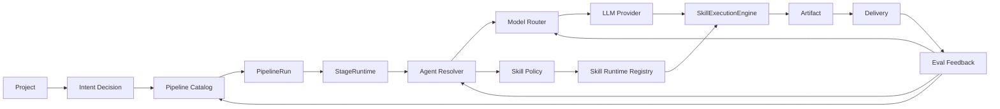

# AI 架构收敛技术设计

## 1. 当前状态

当前代码已经有以下基础：

- Project / Mount / Artifact / Delivery 数据底座。
- PipelineRun / PipelineStageState 阶段状态机。
- StageRuntime 调用 SkillExecutionEngine 推进阶段。
- Agent 管理模型和前端页面。
- SkillManager、SkillInstaller、SkillRegistry、SkillDispatcher、SkillExecutionEngine。
- LLM Provider 抽象。
- Harness、治理、审计、安全、执行步骤可视化等基础模块。

主要缺口是：这些能力还没有完全围绕同一个 AI Runtime Contract 收敛。

## 2. 目标架构



关键原则：

- Project 是顶层作用域。
- Intent 决定 Pipeline，不直接决定执行细节。
- Pipeline Catalog 是阶段事实源。
- StageRuntime 是执行编排点。
- Agent Resolver 决定使用哪个 Agent Profile。
- Model Router 决定模型和兜底策略。
- Skill Policy 决定可用工具和权限。
- Artifact / Delivery / Eval 形成长期反馈闭环。

## 3. 核心运行时契约

### 3.1 ProjectRuntimeContext

用途：阶段执行前组装项目、会话、挂载、策略和权限。

建议字段：

```text
project_id
session_id
pipeline_run_id
mounts
active_mount_id
user_id
workspace_policy
delivery_policy
audit_context
```

### 3.2 IntentDecision

用途：表示用户需求分类结果。

建议字段：

```text
intent_type
confidence
reason
required_capabilities
risk_level
pipeline_key
```

### 3.3 StageDefinition

用途：定义阶段的业务语义和运行策略。

建议字段：

```text
key
name
description
order
required_inputs
output_artifact_types
confirmation_policy
default_agent_selector
model_route_key
skill_policy_key
can_skip
can_restore
```

### 3.4 AgentProfile

用途：把后台 Agent 配置连接到运行时。

建议字段：

```text
id
name
capabilities
default_model_route_key
allowed_skill_names
system_policy_key
stage_preferences
enabled
```

### 3.5 ModelRoute

用途：阶段级模型选择和兜底。

建议字段：

```text
route_key
provider_key
model_key
credential_ref
fallback_route_keys
budget_policy
timeout_seconds
retry_policy
enabled
```

### 3.6 SkillRuntimeSpec

用途：统一内置 Skill、外部 Skill、MCP Tool 的运行时描述。

建议字段：

```text
name
version
source_type
manifest_hash
tool_defs
permissions
executor_kind
enabled
audit_level
```

### 3.7 GovernanceDecision

用途：统一表达阶段、交付和 Skill 调用是否允许、拒绝或要求人工确认。

建议字段：

```text
decision
reason
risk_level
confirmation_type
reason_code
impact_scope
audit_payload
```

### 3.8 ArtifactContract

用途：统一阶段输出和交付输入。

建议字段：

```text
artifact_id
project_id
stage_key
artifact_type
schema_version
content_ref
delivery_state
created_by_agent_profile_id
```

### 3.9 EvalFeedback

用途：记录执行质量、成本、延迟和用户反馈。

建议字段：

```text
pipeline_run_id
stage_key
agent_profile_id
model_route_key
skill_name
status
latency_ms
cost_amount
user_action
failure_reason
score
```

## 4. 模块边界

### 4.1 Pipeline Catalog

现有模块：`src/agent_forge/pipeline/config.py`、`src/agent_forge/pipeline/service.py`、`src/agent_forge/pipeline/runtime.py`。

目标：

- 后端集中维护 intent 到 stages 的映射。
- 提供 API 给前端读取阶段定义。
- StageRuntime 只接收 StageDefinition，不依赖前端硬编码。

建议新增或调整：

```text
src/agent_forge/pipeline/catalog.py
src/api/routes/pipeline_catalog.py
web/src/api/modules/pipelineCatalog.ts
```

### 4.2 Agent Resolver

现有模块：`src/agent_forge/models/agent.py`、`src/agent_forge/agents/`、`src/api/routes/agents.py`、`web/src/views/agents/`。

目标：

- Agent 创建后可以被 StageRuntime 选择。
- 支持 project default、stage default、manual override。
- 记录执行使用的 agent_profile_id。

建议新增或调整：

```text
src/agent_forge/agents/resolver.py
src/agent_forge/models/agent.py
src/agent_forge/models/pipeline.py
```

### 4.3 Model Router

现有模块：`src/agent_forge/llm/provider.py`、`src/agent_forge/models/api_key.py`、`web/src/views/settings/LLMConfig.vue`。

目标：

- Provider / Model / Credential / Route 分层。
- 密钥只保存密文或受保护引用。
- StageRuntime 根据 StageDefinition 和 AgentProfile 解析模型。

实际新增或调整：

```text
src/agent_forge/llm/router.py
src/agent_forge/models/llm.py
src/api/routes/llm.py
web/src/api/modules/llm.ts
web/src/views/settings/LLMConfig.vue
```

结论：`api_key.py` 语义是 AgentForge 服务端访问密钥，不复用为 LLM 供应商 Credential，避免认证密钥和模型密钥混淆。

### 4.4 Skill Runtime Registry

现有模块：`src/agent_forge/skills/manager.py`、`src/agent_forge/skills/installer.py`、`src/agent_forge/skills/registry.py`、`src/agent_forge/mcp/client.py`。

目标：

- 内置 Skill、外部 Skill、MCP Tool 都转为 SkillRuntimeSpec。
- 外部 Skill 安装必须校验 Manifest。
- 调用前经过 SkillPolicy。
- 调用后写审计和 Eval 事件。

实际新增或调整：

```text
src/agent_forge/skills/manifest.py
src/agent_forge/skills/policy.py
src/agent_forge/skills/runtime_spec.py
src/agent_forge/skills/installer.py
src/agent_forge/skills/registry.py
src/agent_forge/skills/dispatcher.py
src/api/routes/skills.py
web/src/views/skills/List.vue
```

完成状态：

- 外部 Skill 安装前通过 Manifest preview 展示来源、工具、权限、风险等级和确认要求。
- `Skill` / `SkillInstall` 保存 manifest_hash、permissions、runtime_spec、risk_level 和 preview。
- `SkillRegistry` 保存 runtime spec 与 tool -> skill 映射。
- `SkillDispatcher` 调用前执行权限策略，拒绝、成功、失败和超时都会输出 `skill_eval` 事件，拒绝/执行路径可写入审计日志。
- Stage 级 `skill_policy_key` 与 AgentProfile allowed skills 的编排留给 GovernancePolicy 阶段。

### 4.5 Governance Policy

现有模块：`src/agent_forge/harness/`、`src/agent_forge/models/audit_log.py`、Pipeline confirmation 机制。

目标：

- 将人工确认点沉淀为策略，而不是写死在某个阶段。
- 技术选型、影响范围、写回交付、高风险 Skill 调用都走统一入口。
- 前端 ConfirmCard 只渲染策略结果。

实际新增或调整：

```text
src/agent_forge/governance/policy.py
src/agent_forge/models/pipeline.py
src/agent_forge/pipeline/service.py
src/api/routes/pipeline_runs.py
src/api/routes/projects.py
src/agent_forge/skills/policy.py
src/agent_forge/skills/dispatcher.py
web/src/components/chat/ConfirmCard.vue
```

完成状态：

- `GovernancePolicy` 统一输出 `allow`、`require_confirmation`、`deny` 三类决策。
- Pipeline 创建阶段状态时写入确认类型、原因、影响范围和审计 payload。
- Delivery 本地写回、GitHub PR、zip 包在缺少确认时写入统一治理决策。
- 高风险 Skill 权限调用前由 SkillPermissionPolicy 复用 GovernancePolicy，拒绝审计包含权限和影响范围。
- 前端 ConfirmCard 只渲染后端策略结果，不自行判断核心风险。

### 4.6 Eval Feedback

目标：

- 记录 Pipeline、Stage、Agent、Model、Skill、Artifact、Delivery 维度指标。
- 不在第一版做复杂评分，先保证事件结构化、可查询。

建议新增：

```text
src/agent_forge/evaluation/events.py
src/agent_forge/evaluation/service.py
src/agent_forge/models/eval_event.py
src/api/routes/evaluation.py
```

## 5. 数据流

### 5.1 一次新需求执行

```text
用户输入
  -> IntentDecision
  -> PipelineCatalog.resolve(intent_type)
  -> PipelineRun + StageStates
  -> StageRuntime.start(stage)
  -> AgentResolver.resolve(project, stage, override)
  -> ModelRouter.resolve(stage, agent)
  -> SkillPolicy.resolve(stage, agent)
  -> SkillExecutionEngine.execute(context)
  -> ArtifactContract.create()
  -> GovernancePolicy.maybe_require_confirmation()
  -> DeliveryService.deliver()
  -> EvalFeedback.record()
```

### 5.2 失败与兜底

- Intent 置信度低：进入需求澄清或 PRD 阶段，不直接执行写回。
- Agent 不可用：回退到阶段默认 Agent 或系统默认 Agent。
- Model Route 不可用：使用 fallback route；兜底失败则阶段失败并记录原因。
- Skill 权限不足：阶段进入 waiting_confirmation 或 failed，取决于策略。
- Delivery 失败：保存失败状态、错误摘要和可重试动作。

## 6. API 设计方向

### 6.1 Pipeline Catalog API

```text
GET /api/pipeline/catalog
GET /api/pipeline/catalog/{intent_type}
```

返回：

```text
intent_type
stages[]
confirmation_policy
default_actions
```

### 6.2 Agent Runtime API

```text
GET /api/agents/runtime-options
PATCH /api/projects/{project_id}/agent-policy
PATCH /api/pipeline-runs/{run_id}/stages/{stage_key}/agent
```

### 6.3 LLM Config API

```text
GET /api/llm/providers
POST /api/llm/credentials
GET /api/llm/model-routes
POST /api/llm/model-routes
PATCH /api/llm/model-routes/{route_key}
```

### 6.4 Skill Import API

```text
POST /api/skills/import/preview
POST /api/skills/import/install
GET /api/skills
```

### 6.5 Evaluation API

```text
GET /api/evaluation/summary
GET /api/evaluation/pipeline-runs/{run_id}
POST /api/evaluation/feedback
```

## 7. 迁移策略

### 第一阶段：新增契约，不改变用户流程

- 增加 AI Runtime Contract 文档和轻量数据结构。
- 保持旧 API 可用。
- StageRuntime 开始记录更多上下文字段。

### 第二阶段：后端事实源替换前端硬编码

- 前端 StagePreview、Pipeline Store 读取 Pipeline Catalog。
- 旧前端常量保留兼容兜底，确认稳定后移除。

### 第三阶段：Agent 和 Model 进入运行时

- StageRuntime 接入 AgentResolver 和 ModelRouter。
- 旧全局 LLM 配置迁移为默认 route。

### 第四阶段：Skill 和 Governance 收敛

- 外部 Skill Manifest、权限、审计完整闭环。
- 人工确认策略统一。

### 第五阶段：Eval 反馈闭环

- 记录结构化执行事件。
- Dashboard 和导出开始消费 Eval 数据。

## 8. 验证策略

每个代码任务必须满足：

- 后端相关变更通过目标 pytest。
- 涉及 FastAPI 路由、配置、中间件、依赖引入时，uvicorn 启动成功。
- 涉及前端时，`npm run build` 通过。
- 涉及 UI 关键流程时，补充 Playwright 或现有 E2E 验证。
- 涉及密钥和 Skill 权限时，补充安全负向用例。
