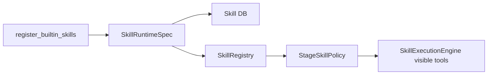

# TASK-037 技术设计

## 当前问题

内置 Skill 注册链路：

```text
register_builtin_skills()
  -> SkillManager.register_skill(...)
  -> SkillRegistry.register(tool_defs, executors)
```

问题是 `SkillManager` 和 `SkillRegistry` 都支持 `runtime_spec`，但内置注册器没有传入。StageSkillPolicy 遇到这些工具时只能看到 tool -> skill 映射，无法判断权限。

## 设计

### 权限模型

新增权限：

```text
external_side_effect
```

含义：工具会对外部系统或用户账户状态产生副作用，例如任意 HTTP 写请求、资料修改、第三方系统操作。

风险等级：

```text
filesystem / shell / credential / external_side_effect -> high
network / project_context -> medium
无权限 -> low
```

### 内置 Skill 权限

| Skill | Tool | Permissions | 默认 StagePolicy |
|------|------|-------------|------------------|
| web-search | `web_search` | `network` | 可见 |
| weather | `get_weather` | `network` | 可见 |
| http-request | `http_request` | `network`, `external_side_effect` | 过滤 |
| update-profile | `update_profile` | `external_side_effect` | 过滤 |
| code-executor | `code_executor` | `shell` | 过滤 |

### RuntimeSpec 生成

内置注册器新增 `_builtin_runtime_spec()`：

- `source_type=builtin`
- `executor_kind=python`
- `executor_entry_point=<module:function>`
- `manifest_hash=sha256(name, version, permissions, tool_names)`
- `source=builtin`

同一份 RuntimeSpec 同步写入 DB `skills.runtime_spec` 和运行时 `SkillRegistry`。

## 数据流



## 兼容性

默认可见工具会从五个内置工具收窄为 `web_search` 和 `get_weather`。高风险工具仍在 registry 中，但需要后续通过明确授权策略暴露，而不是默认交给 LLM 自由选择。
