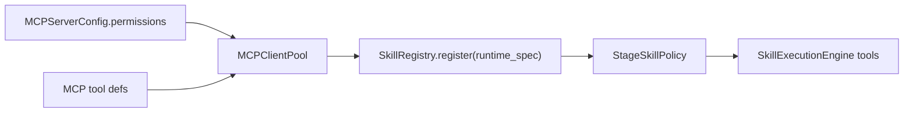

# TASK-036 技术设计

## 当前问题

MCP 当前链路：

```text
MCP_SERVERS
  -> load_mcp_configs()
  -> MCPClientPool.start_all()
  -> MCPServerClient._fetch_tools()
  -> MCPClientPool._register_to_skill_registry()
  -> SkillRegistry.register(tool_defs, executors)
```

缺口是最后一步没有传入 `runtime_spec`。因此 StageRuntime 的工具过滤只能识别 tool -> skill 映射，无法基于 MCP 权限做过滤。

## 设计

### MCPServerConfig

新增字段：

```python
permissions: list[str]
```

规则：

- 显式配置时使用 `normalize_permissions()` 去重和校验。
- 未配置时默认 `["credential"]`，表示未知外部能力，按高风险处理。
- 配置非法权限时跳过 MCP 配置加载，避免服务启动期暴露不确定工具。

### RuntimeSpec Adapter

MCP 注册时构造：

```text
name = mcp_<server>
source_type = mcp
executor_kind = mcp
executor_entry_point = <transport>:<server>
permissions = MCPServerConfig.permissions
tool_defs = clean_tool_defs
mcp_server = server name
mcp_transport = stdio | sse
```

`manifest_hash` 使用 server name、transport、source、permissions 和 tool names 的 sha256，保证同一 MCP Server 工具集合变化时可追溯。

## 数据流



## 安全策略

- 没有权限声明的 MCP Server 不被默认为安全工具。
- `filesystem`、`shell`、`credential` 仍由 StageSkillPolicy 默认过滤。
- SkillDispatcher 调用前权限校验继续作为第二道防线。

## 兼容性

既有 MCP 配置无需立刻修改，但未声明 `permissions` 的 MCP tool 默认高风险，不再在默认 StagePolicy 下暴露。需要使用的 MCP Server 应明确声明最小权限，例如：

```json
{
  "fetch": {
    "type": "stdio",
    "command": "uvx",
    "args": ["mcp-server-fetch"],
    "permissions": ["network"]
  }
}
```
